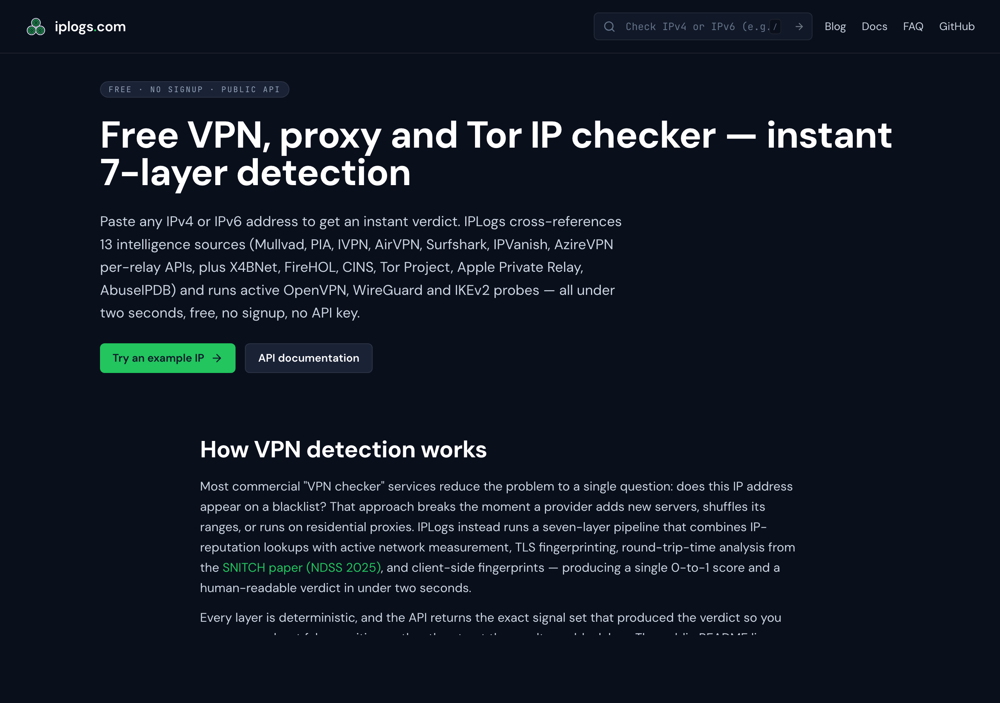
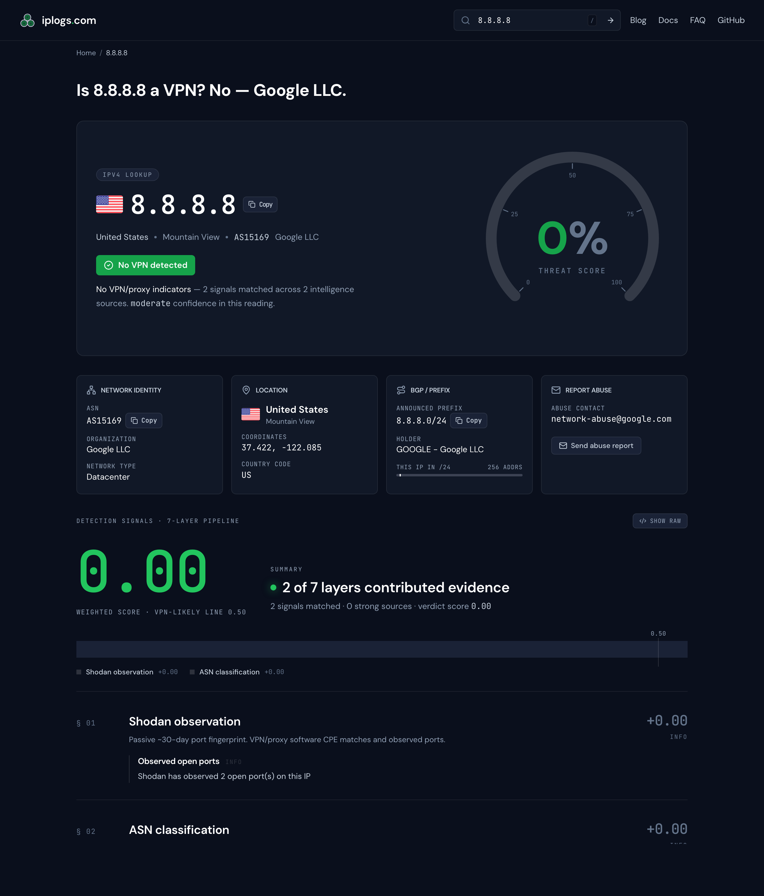
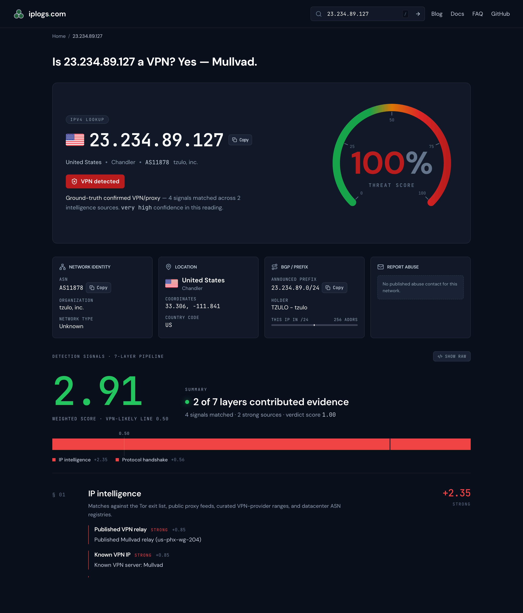
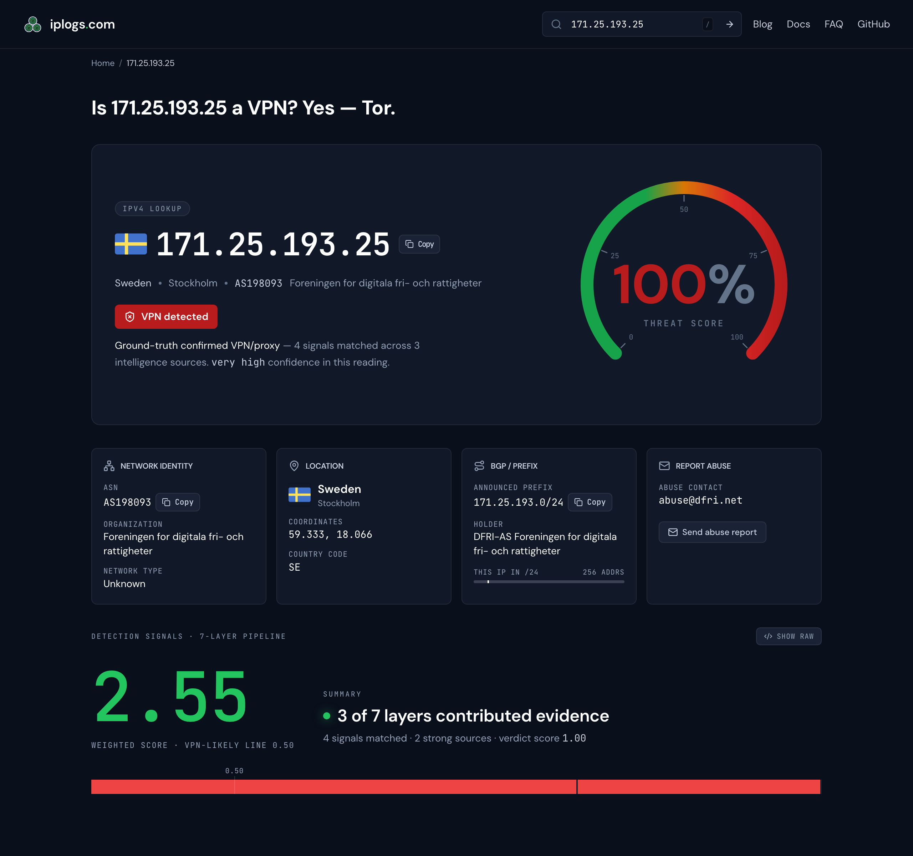
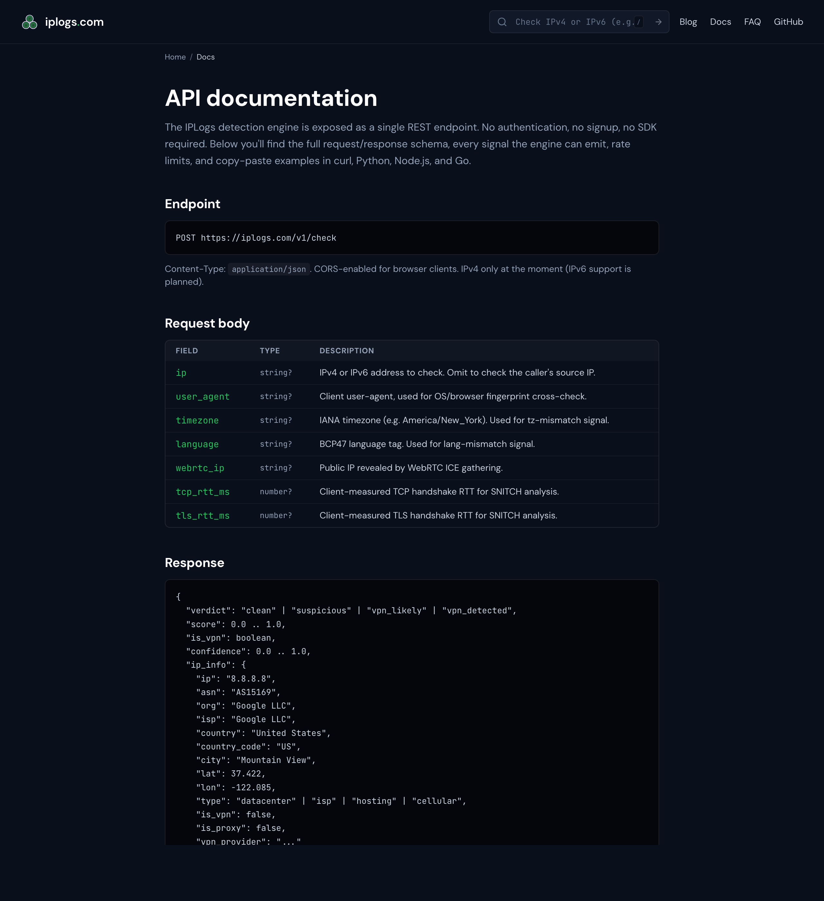

# IPLogs

**Free VPN, proxy, Tor, and datacenter IP detection. No signup. No API key. No catch.**

[iplogs.com](https://iplogs.com) · [Live API](https://iplogs.com/docs) · [Guides](https://iplogs.com/guides) · [Compare to others](https://iplogs.com/compare/vpn-detection-apis)

[](https://iplogs.com)
[](https://iplogs.com/docs)
[](https://iplogs.com/tools)

---

## Why this exists

I wanted a VPN check I could drop into a side project without signing up for anything. Every "free" API I tried needed an account, capped me at 500 requests a day, hid the actual signals behind a paywall, and got Apple Private Relay wrong.

So I built one. It's free, returns every signal that fired (no black-box score), tells you which sources matched (so a user can dispute a false positive), and works for IPv6.

It's been live at [iplogs.com](https://iplogs.com) since early 2026. The detection engine runs on a single Hetzner box and serves the API + dashboard for everyone — feel free to use it.

— *Tanzil ([DigitalD.tech](https://digitald.tech))*

---

## What you get

Paste any IPv4 or IPv6 — get a verdict, a score, and the full signal set in under 2 seconds.



Four verdict buckets:

| Verdict | What it means | Typical action |
|---|---|---|
| `clean` | Real residential / trusted IP | Allow normally |
| `suspicious` | Datacenter / hosting IP — not a real consumer device | Allow read, step up auth on writes |
| `vpn_likely` | Strong signals but no ground-truth match | Elevated risk score |
| `vpn_detected` | Confirmed VPN exit (multi-source agreement) | Block sensitive actions or step up |

### A clean residential / trusted IP

Google's public DNS at 8.8.8.8 — known infrastructure, not a VPN.



### A confirmed VPN exit

A Mullvad relay. The verdict comes with the provider name and every list/feed/probe that flagged it.



### A Tor exit

171.25.193.25 — published Tor exit, picked up from `torbulkexitlist` and onionoo.



---

## Quickstart

The whole API is one POST.

```bash
curl -X POST https://iplogs.com/v1/check \
  -H 'content-type: application/json' \
  -d '{"ip":"8.8.8.8"}'
```

You get back something like:

```json
{
  "verdict": "clean",
  "score": 0.0,
  "is_vpn": false,
  "confidence": 0.4,
  "ip_info": {
    "ip": "8.8.8.8",
    "asn": "AS15169",
    "org": "Google LLC",
    "country": "United States",
    "country_code": "US",
    "vpn_provider": null,
    "vpn_provider_sources": []
  },
  "signals": [
    { "type": "asn_trusted_infra", "weight": 0, "matched": true,
      "detail": "Public DNS resolver — allowlisted" }
  ],
  "request_id": "req_6d740eec-9ed"
}
```

Hit it from any language:

<details>
<summary><b>Node.js / TypeScript</b></summary>

```ts
const r = await fetch("https://iplogs.com/v1/check", {
  method: "POST",
  headers: { "content-type": "application/json" },
  body: JSON.stringify({ ip: "23.234.89.127" }),
});
const data = await r.json();
console.log(data.verdict, data.ip_info.vpn_provider);
// → vpn_detected Mullvad
```
</details>

<details>
<summary><b>Python</b></summary>

```python
import requests

r = requests.post(
    "https://iplogs.com/v1/check",
    json={"ip": "23.234.89.127"},
    timeout=10,
)
data = r.json()
print(data["verdict"], data["ip_info"]["vpn_provider"])
# → vpn_detected Mullvad

# Show the sources that matched (provenance)
for src in data["ip_info"]["vpn_provider_sources"]:
    print("  matched by:", src)
```
</details>

<details>
<summary><b>Go</b></summary>

```go
body := strings.NewReader(`{"ip":"23.234.89.127"}`)
resp, _ := http.Post(
    "https://iplogs.com/v1/check",
    "application/json",
    body,
)
defer resp.Body.Close()

var v struct {
    Verdict string  `json:"verdict"`
    Score   float64 `json:"score"`
    IPInfo  struct {
        VPNProvider string `json:"vpn_provider"`
    } `json:"ip_info"`
}
json.NewDecoder(resp.Body).Decode(&v)
fmt.Println(v.Verdict, v.IPInfo.VPNProvider)
```
</details>

<details>
<summary><b>PHP</b></summary>

```php
$ctx = stream_context_create([
    "http" => [
        "method"  => "POST",
        "header"  => "content-type: application/json",
        "content" => json_encode(["ip" => "23.234.89.127"]),
        "timeout" => 5,
    ],
]);
$body = file_get_contents("https://iplogs.com/v1/check", false, $ctx);
$data = json_decode($body, true);
echo $data["verdict"]; // vpn_detected
```
</details>

<details>
<summary><b>Ruby</b></summary>

```ruby
require "net/http"
require "json"

uri = URI("https://iplogs.com/v1/check")
req = Net::HTTP::Post.new(uri, "Content-Type" => "application/json")
req.body = { ip: "23.234.89.127" }.to_json
res = Net::HTTP.start(uri.host, uri.port, use_ssl: true) { |h| h.request(req) }
puts JSON.parse(res.body)["verdict"]
```
</details>

<details>
<summary><b>Cloudflare Worker (block VPN traffic at the edge)</b></summary>

```ts
export default {
  async fetch(req: Request) {
    const ip = req.headers.get("cf-connecting-ip") ?? "";
    const r = await fetch("https://iplogs.com/v1/check", {
      method: "POST",
      headers: { "content-type": "application/json" },
      body: JSON.stringify({ ip }),
    });
    const { verdict } = await r.json();
    if (verdict === "vpn_detected" && req.method !== "GET") {
      return new Response("VPN traffic blocked on this route", { status: 403 });
    }
    return fetch(req);
  },
};
```
</details>

---

## How detection works

Most "is this a VPN" services boil down to one CIDR list. That breaks the moment a provider rotates ranges or runs on residential proxies.

IPLogs cross-references **13 intelligence sources** plus active protocol probing on every request. If something fires, the response shows you which source caught it — there's no black-box score.



The 13 sources, what they cover, and how often we refresh:

| Source | What it catches | Refresh |
|---|---|---|
| Mullvad API | Every Mullvad relay (IPv4 + IPv6) | 6h |
| PIA server list | Every PIA exit | 12h |
| IVPN gateway list | Every IVPN gateway | 12h |
| AirVPN status API | Every AirVPN exit (4 v4 + 4 v6 per server) | 12h |
| Surfshark cluster API | Every Surfshark cluster + DNS | 12h |
| IPVanish .ovpn bundle | Every IPVanish exit | 12h |
| AzireVPN locations | Every AzireVPN pool | 12h |
| X4BNet aggregator | ProtonVPN, NordVPN, ExpressVPN, CyberGhost, TorGuard, TunnelBear, AtlasVPN, Hotspot Shield (10,671 CIDRs) | 24h |
| Apple iCloud Private Relay | Apple's official egress CSV (~286,845 CIDRs, IPv4 + IPv6) | 24h |
| Cloudflare WARP | AS13335 + ip-api `IsProxy` cross-check | live |
| Tor Project | torbulkexitlist + onionoo IPv6 OR-addresses | 1h |
| FireHOL Level 2/3 + CINS | 45,645 threat-intel CIDRs total | 2h |
| Public proxy aggregator | TheSpeedX × 3 + Proxifly + FireHOL × 4 (~1.9M IPs) | 6h |
| AbuseIPDB | On-demand community reports (24h cache) | live |
| Active probing | OpenVPN HARD_RESET, WireGuard, IKEv2, SOCKS5, HTTP CONNECT, REALITY | per-request |
| TCP/IP, TLS, JA3/JA4 | Fingerprint anomalies | per-request |
| RTT analysis | [SNITCH](https://www.ndss-symposium.org/ndss2025/) NDSS 2025 + cross-layer | per-request |
| PeeringDB + RIPEStat | ASN classification, BGP topology | bulk + live |

When more than one source agrees, you see them all in `vpn_provider_sources[]`. That's the dispute trail when someone says "but I'm not on a VPN."

---

## Endpoints

| Method | Path | Notes |
|---|---|---|
| `POST` | `/v1/check` | Single-IP detection. Full signal data. ~2s p50, 30s timeout. |
| `POST` | `/v1/bulk-check` | Up to 100 IPs per call. Compact response. 90s timeout. |
| `GET` | `/v1/health` | Health probe. |
| `GET` | `/v1/datasets/vpn-providers` | Aggregated VPN-provider snapshot (CC-BY 4.0). |

Full reference: **[iplogs.com/docs](https://iplogs.com/docs)**

### Bulk lookups

```bash
curl -X POST https://iplogs.com/v1/bulk-check \
  -H 'content-type: application/json' \
  -d '{"ips":["8.8.8.8","1.1.1.1","23.234.89.127"]}'
```

---

## Free datasets (CC-BY 4.0)

The same data the engine reads — you can download and rehost.

| URL | What's in it |
|---|---|
| [`/data/tor-exits.csv`](https://iplogs.com/data/tor-exits.csv) | Live Tor exit list (merged IPv4 + IPv6) |
| [`/data/mullvad-relays.csv`](https://iplogs.com/data/mullvad-relays.csv) | Every active Mullvad relay |
| [`/data/aws-ranges.json`](https://iplogs.com/data/aws-ranges.json) | AWS IP ranges (mirror) |
| [`/data/gcp-ranges.json`](https://iplogs.com/data/gcp-ranges.json) | GCP IP ranges (mirror) |
| [`/data/cloudflare-ranges.txt`](https://iplogs.com/data/cloudflare-ranges.txt) | Cloudflare ranges (IPv4 + IPv6) |
| [`/data/firehol-abusers.txt`](https://iplogs.com/data/firehol-abusers.txt) | FireHOL Level 1 threat-intel |
| [`/data/spamhaus-drop.txt`](https://iplogs.com/data/spamhaus-drop.txt) | Spamhaus DROP list |
| [`/data/datacenter-asns.csv`](https://iplogs.com/data/datacenter-asns.csv) | Hosting-provider ASN catalog |
| [`/data/vpn-providers.csv`](https://iplogs.com/data/vpn-providers.csv) | VPN-provider catalog with detection methodology |
| [`/data/residential-proxy-backbones.csv`](https://iplogs.com/data/residential-proxy-backbones.csv) | Residential-proxy backbone IPs |

Full catalog at [iplogs.com/tools](https://iplogs.com/tools).

---

## Guides (the things people actually want to do)

- **[How to detect VPN users on your website](https://iplogs.com/guides/detect-vpn-users)** — Node, Python, Go, PHP, Cloudflare Worker
- **[How to block VPN, proxy, Tor traffic](https://iplogs.com/guides/block-vpn-traffic)** — Cloudflare WAF, Nginx, Caddy, Stripe Radar recipes
- **[Why is my IP flagged as a VPN?](https://iplogs.com/guides/why-flagged-as-vpn)** — 12 real reasons (CGNAT, iCloud Private Relay, household residential proxies) and how to dispute
- **[Residential vs datacenter IP detection](https://iplogs.com/guides/residential-proxy-detection)** — Why ASN alone isn't enough

---

## Use cases

I built this for fraud / risk / ad-ops teams who don't want to sign three vendor contracts before they can prototype something:

- **Signup / payment friction** — block confirmed VPNs at signup, step up auth on `vpn_likely`
- **Geo-licensing** — keep streaming or regulatory geo-restrictions enforceable
- **Bot & scraper defense** — datacenter IPs are filtered without a CAPTCHA round-trip
- **Ad-fraud auditing** — verify media-buy traffic isn't proxy-farm origin
- **Support triage** — when a user says "I'm being blocked" you can paste their IP and see exactly which source flagged them
- **Compliance logging** — record verdict + provenance alongside privileged requests

---

## Honest comparison

I keep an honest comparison table at **[iplogs.com/compare/vpn-detection-apis](https://iplogs.com/compare/vpn-detection-apis)** including IPQS, IPHub, GetIPIntel, VPNAPI.io, Spur, IPinfo. Short version:

|  | IPLogs | IPQS | IPHub | VPNAPI | Spur |
|---|:---:|:---:|:---:|:---:|:---:|
| Free, no signup | ✅ | ❌ | ❌ | ❌ | ❌ |
| Per-signal visibility | ✅ | ❌ | ❌ | partial | ✅ |
| Active protocol probing | ✅ | partial | ❌ | ❌ | partial |
| Apple Private Relay separated | ✅ | ❌ | ❌ | ❌ | ❌ |
| IPv6 first-class | ✅ | ✅ | partial | partial | ✅ |
| Open methodology | ✅ | ❌ | ❌ | ❌ | ❌ |
| Per-relay direct ingestion | 7 providers | none public | ❌ | ❌ | ❌ |

---

## Accuracy

Last clean baseline against an ASN-validated 1,100-IP ground-truth corpus:

- **0.3%** false-positive rate
- **0.9%** false-negative rate
- **100%** Mullvad true-positive
- **100%** Tor true-positive

The 3 nominal FPs were corpus-mislabel residuals, not detection bugs.

---

## Performance

| Path | Latency |
|---|---|
| Popular IP (cached) | <1 ms |
| Recently checked (within 5 min) | <1 ms |
| Novel IP, fast path | ~1.9 s p50 |
| Novel IP, hard datacenter (cold cache) | 5–7 s p95 |
| Stuck upstream (any source) | 8 s ceiling, never exceeded |

Single Hetzner VM in Germany. Caddy → Go API on port 9092. Built in Go for the 7-layer fan-out, Next.js for the dashboard.

---

## What about my own IP?

Visit **[iplogs.com](https://iplogs.com)** — your IP is checked live and you see the same response your API would. If you're being incorrectly flagged, the page tells you exactly which source flagged you, which is your dispute trail.

---

## Project policy

- The detection engine itself is **closed source** — too easy to abuse if every signal weight and probe pattern is public.
- The **public documentation** (this repo), the **datasets** (`/data/*`), and the **API** are all free and open.
- License on this README and the data downloads: **CC-BY 4.0**.

---

## Need higher rate limits?

The free API is rate-limited per source IP. If you're running sustained multi-million-request workloads, email **admin@iplogs.com** with your use case, expected volume, and SLA needs. Dedicated infrastructure with higher limits is available.

---

## Citation

If you reference IPLogs in a paper, blog post, or product:

```
IPLogs (2026). Free multi-layer VPN, proxy and IP-intelligence service.
DigitalD.tech. https://iplogs.com.
```

---

## Contact

- **Web:** [iplogs.com](https://iplogs.com)
- **Email:** [admin@iplogs.com](mailto:admin@iplogs.com)
- **Built by:** [DigitalD.tech](https://digitald.tech)

If something is wrong (a misclassified IP, a broken example, a missing source) — open an issue or email me. I read everything.
